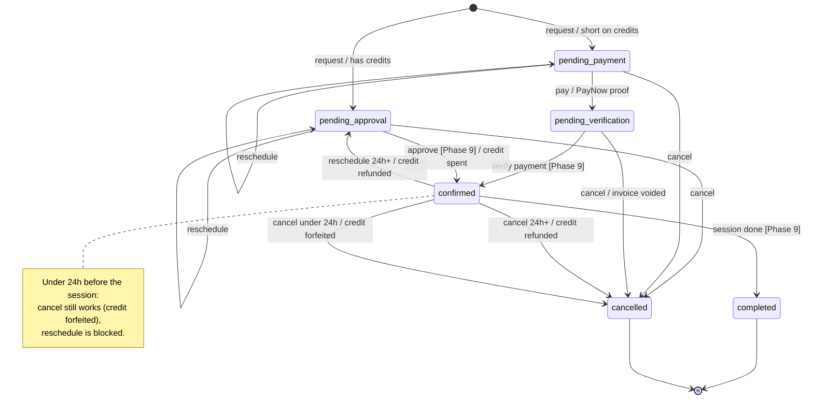

# Booking Lifecycle — States & Transitions

How a single `booking` row moves from *requested* to *completed* or *cancelled*, and the
credit-ledger / invoice side effects at each step. Covers Phases 3–5 (client side); the
transitions marked **Phase 9** are the trainer-portal actions that aren't built yet, so
`pending_approval` and `pending_verification` are currently dead ends.

Source of truth: `booking.status` (`packages/database/src/schema/booking.ts`),
`src/lib/booking.ts` (`cancelOutcome`, `canReschedule`, `creditCostFor`), the `?/request` /
`?/reschedule` actions in `src/routes/(app)/bookings/[slug]/+page.server.ts`, and the `?/pay` /
`?/cancel` / `?/reflect` actions + `src/lib/server/cancellation.ts` under
`src/routes/(app)/bookings/`.

## State diagram



## The states

| State | Meaning | Occupies a calendar slot? |
| :-- | :-- | :-- |
| `pending_approval` | Requested; client has the credits (or it's a free consult). Waiting on the trainer. | yes |
| `pending_payment` | Requested; client is short on credits and must pay cash to hold it. | yes |
| `pending_verification` | Client uploaded a PayNow screenshot; waiting for someone to verify it (Phase 9). | yes |
| `confirmed` | Locked in — on both calendars. | yes |
| `completed` | Session happened. | no (in the past) |
| `cancelled` | Called off by the client (or, later, the trainer). Hidden from the client's list. | no |

"Occupies a slot" = the status is in `ACTIVE_BOOKING_STATUSES`, so `availability.ts` blocks
that time for other bookings.

## Entry: `?/request` (`bookings/[slug]`)

`creditCost = creditCostFor(type, durationMin)` → `0.00` (free consult) / `0.75` (45m) /
`1.00` (60m) / `1.50` (90m).

```
status = (creditCost == 0 || creditBalance >= creditCost) ? pending_approval : pending_payment
```

Gates enforced by the form **and** re-checked server-side:

- **Timezone** — if the client's zone ≠ the coach's zone, only online session types are offered.
- **Screening** — no submitted PAR-Q → only `free consult` bookable.
- **Package expiry** — the start must be on or before the active package's `expiresAt`.
- **Slot** — the posted time is recomputed from the coach's weekly windows; a stale/taken/past
  slot is rejected. The action never trusts the posted instant.

No credit ledger entry is written at request time — the credit is only spent when the trainer
confirms the booking (Phase 9, `reason: session_confirmed`).

## `?/pay` (PayNow) — `pending_payment → pending_verification`

1. Re-fetch the booking as the owner's `pending_payment` (never trust the client for status/amount).
2. Upload the screenshot to object storage.
3. Insert an `invoice`: `status: pending`, `method: "paynow · awaiting verification"`,
   `proofImageKey`, `amountCents = sessionAmountCents(coach.rateFromCents, durationMin)`.
4. `booking.status → pending_verification`.

Verification → `confirmed` is **Phase 9** and deliberately unbuilt (no throwaway admin UI).

## `?/reschedule` (`bookings/[slug]?reschedule=<id>`)

Same coach only. Reuses the live slot grid and all four request-time gates. The booking's own
current slot is excluded from the "busy" set so it doesn't block itself.

`canReschedule(status, startsAt)`:

| From status | Allowed? | Resulting status | Ledger |
| :-- | :-- | :-- | :-- |
| `pending_approval` | yes | `pending_approval` | — |
| `pending_payment` | yes | `pending_payment` | — |
| `confirmed`, ≥24h out | yes | `pending_approval` | `+creditCost` (`refund_in_time`) — Phase 9 re-approval re-charges cleanly |
| `confirmed`, <24h out | **no** | — | — |
| `completed` / `cancelled` | no | — | — |

`type` / `durationMin` / `location` / `clientNote` are all updated from the form, and
`creditCost` is recomputed.

## `?/cancel` — `cancelBooking()` (`src/lib/server/cancellation.ts`)

`cancelOutcome(status, startsAt)` decides the side effect. All run in one transaction that also
sets `status: cancelled`, `cancelledAt: now`.

| From status | `cancelOutcome` | Ledger | Invoice |
| :-- | :-- | :-- | :-- |
| `pending_approval` | `none` | — | — |
| `pending_payment` | `none` | — | — |
| `pending_verification` | `void` | — | linked `pending` invoice → `no_charge`, `method: "paynow · cancelled before verification"` |
| `confirmed`, ≥24h out | `refund` | `+creditCost` (`refund_in_time`) | — |
| `confirmed`, <24h out | `forfeit` | — (already-spent credit stays spent) | new `no_charge` "late cancellation" invoice (mirrors seed `bwh-0118`) |
| `completed` / `cancelled` | `blocked` | action rejected | — |

`CANCELLATION_WINDOW_HOURS = 24`, hardcoded in `src/lib/booking.ts` until Phase 10's admin
settings.

## `?/reflect` — not a state change

Writes `booking.client_reflection` (client's own post-session note). Allowed only when the
booking is `completed` or its start is in the past. Independent of status; no ledger/invoice effect.

## Credit ledger reasons, by trigger

| Reason | When | Sign |
| :-- | :-- | :-- |
| `purchase` | package bought (Phase 6) | + |
| `session_confirmed` | trainer approves a booking (Phase 9) | − |
| `refund_in_time` | cancel ≥24h out, or reschedule of a confirmed booking | + |
| `late_cancel_forfeit` | *defined but unused* — a `<24h` cancel writes a `no_charge` invoice instead of a ledger row | − |
| `adjustment` | manual admin correction (Phase 10) | ± |

## What's built vs. pending

- **Built (Phases 3–5):** request, pay (PayNow), reschedule, cancel, reflect — the whole
  left side of the diagram down to `pending_verification` / `pending_approval`.
- **Phase 9:** approve (`pending_approval → confirmed`), verify payment
  (`pending_verification → confirmed`), mark complete (`confirmed → completed`), and the
  trainer-initiated cancel/decline paths.
- **Phase 12:** Stripe card flow as an alternative to `pending_payment → pending_verification`.
