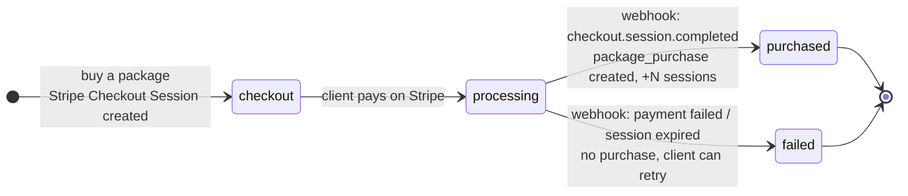

# Booking & Package Lifecycle

Two independent state machines: a **booking** (a scheduled session) and a **package purchase**
(prepaid sessions, paid via Stripe). Money lives entirely on the purchase side, so a booking
never has a payment state — it only ever needs a session already in hand.

Source of truth: `booking.status` (`packages/database/src/schema/booking.ts`), `src/lib/booking.ts`
(`cancelOutcome`, `canReschedule`), the `?/request` / `?/reschedule` actions in
`src/routes/(app)/bookings/[slug]/+page.server.ts`, `?/cancel` / `?/reflect` +
`src/lib/server/cancellation.ts` under `src/routes/(app)/bookings/`, and the `?/buy` action +
Stripe webhook under `src/routes/(app)/packages/`.

## Booking state machine


| State | Meaning | Occupies a calendar slot? |
| :-- | :-- | :-- |
| `pending_approval` | Requested; a session is held against an active package (or it's a free consult). Waiting on the coach. | yes |
| `confirmed` | Approved — on both calendars, one session drawn from the package. | yes |
| `completed` | Session happened. | no (past) |
| `cancelled` | Called off. Hidden from the client's list. | no |

"Occupies a slot" = the status is in `ACTIVE_BOOKING_STATUSES`, so `availability.ts` blocks that
time for other bookings.

## Package purchase state machine



- **`checkout`** — `?/buy` creates a Stripe Checkout Session for the package total and an
  `invoice` row (`status: pending`, `package_id`, `stripe_checkout_session_id`), then redirects
  the client to Stripe's hosted page.
- **`processing`** — client is on/has left Stripe's page; the webhook hasn't landed yet (usually
  seconds). `/packages` shows this purchase under "processing."
- **`purchased`** — the Stripe webhook creates the `package_purchase` (`sessions_granted`,
  `session_length_min` snapshot, `expires_at` = now + `validity_days`), writes the `+N`
  `purchase` ledger entry, and flips the invoice to `paid`. Fully automatic, no human review.
- **`failed`** — payment declined or the checkout session expired unused. Invoice reflects the
  failure; no sessions granted; the client can start a new checkout.

## Packages & sessions

A **package** (`package` table, coach-authored) is `session_count` sessions of
`session_length_min` minutes at `price_per_session_cents` each, valid `validity_days` from
purchase. Total price = count × per-session cost.

Balance **with a coach** = Σ `session_ledger_entry.delta` over that client's non-expired
purchases from the coach. A booking draws from the active purchase **expiring soonest** (FIFO)
and consumes exactly **one** session — no fractional costs.

`session_ledger_entry` is append-only. `delta` is whole sessions:

| Reason | When | Sign |
| :-- | :-- | :-- |
| `purchase` | Stripe webhook confirms payment | `+session_count` |
| `session_consumed` | coach approves a booking | `−1` |
| `returned_in_time` | cancel ≥24h out, or reschedule of a confirmed booking | `+1` |
| `adjustment` | manual admin correction | `±` |

There is no "forfeit" ledger row — a `<24h` cancel just leaves the `−1` in place.

## `?/request` (`bookings/[slug]`)

The client picks a session **type** (in-person / online / consult / assessment) and, if they
hold packages with this coach, **which package** to draw from — the session **length follows the
package**. Free consult is special: free, no package, fixed 30 min.

```
free consult                                          → pending_approval  (no package)
active purchase with this coach, balance − holds ≥ 1   → pending_approval  (packagePurchaseId set)
no active package                                      → form is replaced by "get a {coach} package to book"
```

Gates (form **and** re-checked server-side):

- **Timezone** — client zone ≠ coach zone → only online session types.
- **Screening** — no submitted PAR-Q → only `free consult`.
- **Package expiry** — the start must be ≤ the chosen purchase's `expires_at`.
- **Slot** — recomputed from the coach's weekly windows; stale / taken / past → rejected.

No ledger entry at request time — the session is spent when the coach approves.
"Holds" = the client's other `pending_approval` bookings against the same purchase.

## `?/buy` (`/packages`) — standalone package purchase

Review (package, total) → redirect to Stripe Checkout → client pays → webhook creates the
`package_purchase` + grants sessions, no human in the loop.

Triggered from `/packages` ("get more sessions") and from `/bookings/[slug]` when the client has
no package with that coach.

## `?/reschedule` (`bookings/[slug]?reschedule=<id>`)

Same coach only; keeps the booking's package + length, changes the slot. Reuses the slot grid
and all request-time gates; the booking's own slot is excluded from "busy".

| From status | Allowed? | Resulting status | Ledger |
| :-- | :-- | :-- | :-- |
| `pending_approval` | yes | `pending_approval` | — |
| `confirmed`, ≥24h out | yes | `pending_approval` | `+1` (`returned_in_time`) — re-approval re-consumes |
| `confirmed`, <24h out | **no** | — | — |
| `completed` / `cancelled` | no | — | — |

## `?/cancel` — `cancelBooking()` (`src/lib/server/cancellation.ts`)

No cash refunds — a package is bought as a block. `cancelOutcome(status, startsAt)`:

| From status | Outcome | Effect |
| :-- | :-- | :-- |
| `pending_approval` | `none` | plain cancel — no session was consumed |
| `confirmed`, ≥24h out | `return` | `+1` session to the booking's purchase (`returned_in_time`) |
| `confirmed`, <24h out | `forfeit` | the `−1` stands — nothing else |
| `completed` / `cancelled` | `blocked` | rejected |

`CANCELLATION_WINDOW_HOURS = 24`, hardcoded until the admin settings phase.

## `?/reflect` — not a state change

Writes `booking.client_reflection` (client's post-session note). Allowed when the booking is
`completed` or its start is in the past. No ledger / invoice effect.

## Trainer actions

Approve (`pending_approval → confirmed`, consumes a session), mark complete, and trainer-initiated
cancel/decline. Package purchases need no trainer review — the Stripe webhook resolves them on
its own.
