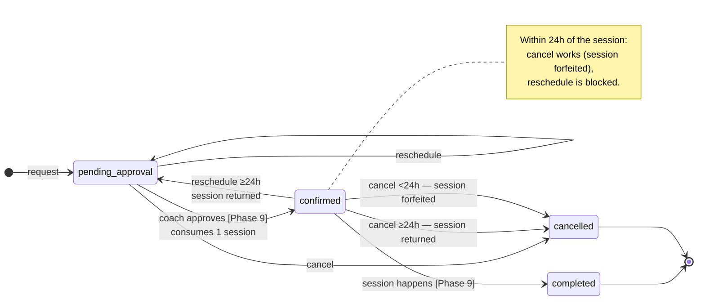
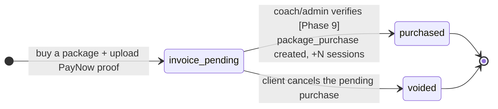

# Booking & Package Lifecycle

Two independent state machines: a **booking** (a scheduled session) and a **package purchase**
(prepaid sessions). Phase 6 decoupled them — money is handled entirely on the purchase side, so a
booking never has a payment state.

> **Model note.** Phases 3–5 shipped a global *credit* model; Phase 5.5 replaced it with
> coach-authored *packages*; **Phase 6** split package-buying out of the booking flow (dropping
> `pending_payment` / `pending_verification` from `booking`). Transitions marked **Phase 9** are
> trainer-portal actions that aren't built — so `pending_approval` bookings and unverified
> purchases are currently dead ends.

Source of truth: `booking.status` (`packages/database/src/schema/booking.ts`), `src/lib/booking.ts`
(`cancelOutcome`, `canReschedule`), the `?/request` / `?/reschedule` actions in
`src/routes/(app)/bookings/[slug]/+page.server.ts`, `?/cancel` / `?/reflect` +
`src/lib/server/cancellation.ts` under `src/routes/(app)/bookings/`, and the `?/buy` action
(`src/routes/(app)/packages/`).

## Booking state machine



| State | Meaning | Occupies a calendar slot? |
| :-- | :-- | :-- |
| `pending_approval` | Requested; a session is held against an active package (or it's a free consult). Waiting on the coach. | yes |
| `confirmed` | Approved — on both calendars, one session drawn from the package. | yes |
| `completed` | Session happened. | no (past) |
| `cancelled` | Called off. Hidden from the client's list. | no |

"Occupies a slot" = the status is in `ACTIVE_BOOKING_STATUSES`, so `availability.ts` blocks that
time for other bookings. (`pending_payment` / `pending_verification` still exist in the
`BookingStatus` type for historical rows but are never written.)

## Package purchase state machine



- **`invoice_pending`** — an `invoice` row (`status: pending`, `package_id`, `proof_image_key`,
  `method: "paynow · awaiting verification"`, `amount_cents` = package total). No
  `package_purchase`, no sessions yet.
- **`purchased`** — Phase 9 verification creates the `package_purchase`
  (`sessions_granted`, `session_length_min` snapshot, `expires_at` = now + `validity_days`),
  writes the `+N` `purchase` ledger entry, and flips the invoice to `paid`.

Until Phase 9 ships, buying a package is a dead end — the pending invoice just sits in the
"awaiting verification" list on `/packages`.

## Packages & sessions

A **package** (`package` table, coach-authored) is `session_count` sessions of
`session_length_min` minutes at `price_per_session_cents` each, valid `validity_days` from
purchase. Total price = count × per-session cost.

Balance **with a coach** = Σ `session_ledger_entry.delta` over that client's non-expired
purchases from the coach. A booking draws from the active purchase **expiring soonest** (FIFO)
and consumes exactly **one** session — no fractional costs.

`session_ledger_entry` is append-only. `delta` is whole sessions:

| Reason | When | Sign |
| :-- | :-- | :-- |
| `purchase` | package verified (Phase 9) | `+session_count` |
| `session_consumed` | coach approves a booking (Phase 9) | `−1` |
| `returned_in_time` | cancel ≥24h out, or reschedule of a confirmed booking | `+1` |
| `adjustment` | manual admin correction (Phase 10) | `±` |

There is no "forfeit" ledger row — a `<24h` cancel just leaves the `−1` in place.

## `?/request` (`bookings/[slug]`)

The client picks a session **type** (in-person / online / consult / assessment) and, if they
hold packages with this coach, **which package** to draw from — the session **length follows the
package**. Free consult is special: free, no package, fixed 30 min.

```
free consult                                   → pending_approval  (no package)
active purchase with this coach, balance − holds ≥ 1  → pending_approval  (packagePurchaseId set)
no active package                              → form is replaced by "get a {coach} package to book"
```

Gates (form **and** re-checked server-side):

- **Timezone** — client zone ≠ coach zone → only online session types.
- **Screening** — no submitted PAR-Q → only `free consult`.
- **Package expiry** — the start must be ≤ the chosen purchase's `expires_at`.
- **Slot** — recomputed from the coach's weekly windows; stale / taken / past → rejected.

No ledger entry at request time — the session is spent when the coach approves (Phase 9).
"Holds" = the client's other `pending_approval` bookings against the same purchase.

## `?/buy` (`/packages`) — standalone package purchase

Review (package, total, PayNow QR) → upload proof → insert an `invoice`
(`status: pending`, `package_id`, `proof_image_key`, `method: "paynow · awaiting verification"`,
`amount_cents` = total). Nothing else — no `package_purchase`, no sessions. Phase 9 verifies.

Triggered from `/packages` ("get more sessions") and from `/bookings/[slug]` when the client has
no package with that coach.

## `?/reschedule` (`bookings/[slug]?reschedule=<id>`)

Same coach only; keeps the booking's package + length, changes the slot. Reuses the slot grid
and all request-time gates; the booking's own slot is excluded from "busy".

| From status | Allowed? | Resulting status | Ledger |
| :-- | :-- | :-- | :-- |
| `pending_approval` | yes | `pending_approval` | — |
| `confirmed`, ≥24h out | yes | `pending_approval` | `+1` (`returned_in_time`) — Phase 9 re-approval re-consumes |
| `confirmed`, <24h out | **no** | — | — |
| `completed` / `cancelled` | no | — | — |

## `?/cancel` — `cancelBooking()` (`src/lib/server/cancellation.ts`)

No cash refunds — a package is bought as a block. `cancelOutcome(status, startsAt)`:

| From status | Outcome | Effect |
| :-- | :-- | :-- |
| `pending_approval` | `none` | plain cancel — no session was consumed |
| `confirmed`, ≥24h out | `return` | `+1` session to the booking's purchase (`returned_in_time`) |
| `confirmed`, <24h out | `forfeit` | the `−1` stands — nothing else |
| `completed` / `cancelled` | `blocked` | rejected |

`CANCELLATION_WINDOW_HOURS = 24`, hardcoded until Phase 10's admin settings.

## `?/reflect` — not a state change

Writes `booking.client_reflection` (client's post-session note). Allowed when the booking is
`completed` or its start is in the past. No ledger / invoice effect.

## What's built vs. pending

- **Phase 6:** booking / purchase decoupled; `/packages`, `/payments`, `/activity` pages;
  standalone `?/buy`.
- **Phase 9:** approve (`pending_approval → confirmed`, consume a session), verify a package
  purchase (create `package_purchase` + grant + flip invoice to `paid`), mark complete, and
  trainer-initiated cancel / decline.
- **Phase 12:** Stripe as an alternative to the PayNow-proof purchase flow.
