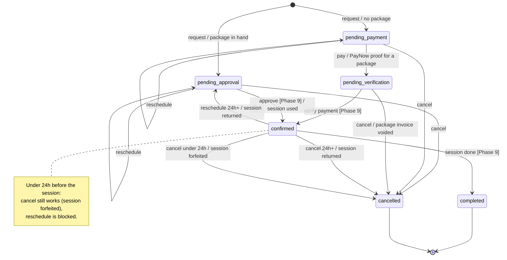

# Booking Lifecycle — States & Transitions

How a single `booking` row moves from *requested* to *completed* or *cancelled*, and the
package / session-ledger / invoice side effects at each step.

> **Model note.** This reflects the **Phase 5.5** model — coach-authored *packages* of prepaid
> *sessions*. Phases 3–5 shipped with a global *credit* model (one platform-wide session price);
> Phase 5.5 replaces it. Where behaviour hasn't been rebuilt yet the text says so. See
> `ROADMAP.md` → Phase 5.5. Transitions marked **Phase 9** are trainer-portal actions that aren't
> built — so `pending_approval` and `pending_verification` are currently dead ends.

Source of truth: `booking.status` (`packages/database/src/schema/booking.ts`),
`src/lib/booking.ts` (`cancelOutcome`, `canReschedule`), the `?/request` / `?/reschedule` actions
in `src/routes/(app)/bookings/[slug]/+page.server.ts`, and the `?/pay` / `?/cancel` / `?/reflect`
actions + `src/lib/server/cancellation.ts` under `src/routes/(app)/bookings/`.

## State diagram



## The states

| State | Meaning | Occupies a calendar slot? |
| :-- | :-- | :-- |
| `pending_approval` | Requested; client holds a session in an active package with this coach. Waiting on the trainer. | yes |
| `pending_payment` | Requested; client has no package with this coach and must buy one to hold it. | yes |
| `pending_verification` | Client uploaded a PayNow screenshot for a package; waiting for someone to verify it (Phase 9). | yes |
| `confirmed` | Locked in — on both calendars, one session drawn from the client's package. | yes |
| `completed` | Session happened. | no (in the past) |
| `cancelled` | Called off by the client (or, later, the trainer). Hidden from the client's list. | no |

"Occupies a slot" = the status is in `ACTIVE_BOOKING_STATUSES`, so `availability.ts` blocks
that time for other bookings.

## Packages & sessions

A **package** (`package` table, coach-authored) is `session_count` sessions of
`session_length_min` minutes, at `price_per_session_cents` each, valid `validity_days` from
purchase. Total price = count × per-session cost.

Buying one writes a **`package_purchase`** (`sessions_granted`, `session_length_min` snapshot,
`expires_at`). The client's **balance with a coach** = the sum of `session_ledger_entry.delta`
over their non-expired purchases from that coach. A booking draws from the active purchase
**expiring soonest** (FIFO). One booking always consumes exactly **one** session — no fractional
costs.

`session_ledger_entry` is append-only. `delta` is whole sessions:

| Reason | When | Sign |
| :-- | :-- | :-- |
| `purchase` | package bought / verified | `+session_count` |
| `session_consumed` | trainer approves or verifies a booking (Phase 9) | `−1` |
| `returned_in_time` | cancel ≥24h out, or reschedule of a confirmed booking | `+1` |
| `adjustment` | manual admin correction (Phase 10) | `±` |

There is no separate "forfeit" ledger row — a `<24h` cancel just leaves the `−1` in place.

## Entry: `?/request` (`bookings/[slug]`)

The client picks a session **type** (in-person / online / consult / assessment) and, if they
hold a package with this coach, a **package** — the session **length follows the package**.
Free consult is special: free, no package, fixed 30 min.

```
has an active purchase with this coach AND (balance − pending holds) ≥ 1
    → pending_approval   (session consumed later, at Phase 9 approval)
otherwise
    → pending_payment    (booking carries intended_package_id + the package's length)
```

Gates enforced by the form **and** re-checked server-side:

- **Timezone** — client zone ≠ coach zone → only online session types.
- **Screening** — no submitted PAR-Q → only `free consult`.
- **Package expiry** — the start must be on or before the chosen purchase's `expires_at`.
- **Slot** — the posted time is recomputed from the coach's weekly windows; a stale / taken /
  past slot is rejected. The action never trusts the posted instant.

No ledger entry at request time — the session is only spent when the trainer confirms the
booking (Phase 9).

## `?/pay` (PayNow) — `pending_payment → pending_verification`

The Phase 4 checkout modal sells the **whole package** the client picked at request time
(`intended_package_id`), not a single session.

1. Re-fetch the booking as the owner's `pending_payment` (never trust the client for
   status / package / amount).
2. Upload the screenshot to object storage.
3. Insert an `invoice`: `status: pending`, `method: "paynow · awaiting verification"`,
   `proofImageKey`, `amountCents` = package total (`session_count × price_per_session_cents`),
   linked to the intended package.
4. `booking.status → pending_verification`.

The `package_purchase`, the `+session_count` ledger entry, and the first `−1` consumption all
happen at **Phase 9** verification — so `pending_verification` is a clean dead end until then.

## `?/reschedule` (`bookings/[slug]?reschedule=<id>`)

Same coach only. The booking keeps its package and length — only the slot changes. Reuses the
live slot grid and all four request-time gates; the booking's own current slot is excluded from
the "busy" set so it doesn't block itself.

`canReschedule(status, startsAt)`:

| From status | Allowed? | Resulting status | Ledger |
| :-- | :-- | :-- | :-- |
| `pending_approval` | yes | `pending_approval` | — |
| `pending_payment` | yes | `pending_payment` | — |
| `confirmed`, ≥24h out | yes | `pending_approval` | `+1` (`returned_in_time`) — Phase 9 re-approval re-consumes |
| `confirmed`, <24h out | **no** | — | — |
| `completed` / `cancelled` | no | — | — |

## `?/cancel` — `cancelBooking()` (`src/lib/server/cancellation.ts`)

No cash refunds — a package is bought as a block. `cancelOutcome(status, startsAt)` decides
whether the session goes back to the pack or is burned. All run in one transaction that also
sets `status: cancelled`, `cancelledAt: now`.

| From status | `cancelOutcome` | Effect |
| :-- | :-- | :-- |
| `pending_approval` / `pending_payment` | `none` | plain cancel — no session was consumed |
| `pending_verification` | `void` | linked `pending` invoice → `no_charge`, `method: "paynow · cancelled before verification"` (the package purchase never happened) |
| `confirmed`, ≥24h out | `return` | `+1` session to the booking's purchase (`returned_in_time`) |
| `confirmed`, <24h out | `forfeit` | the `−1` stands — nothing else |
| `completed` / `cancelled` | `blocked` | action rejected |

`CANCELLATION_WINDOW_HOURS = 24`, hardcoded in `src/lib/booking.ts` until Phase 10's admin
settings.

## `?/reflect` — not a state change

Writes `booking.client_reflection` (client's own post-session note). Allowed only when the
booking is `completed` or its start is in the past. Independent of status; no ledger / invoice
effect.

## What's built vs. pending

- **Phases 3–5 (shipped, credit model):** request, pay, reschedule, cancel, reflect — the whole
  left side of the diagram down to `pending_verification` / `pending_approval`.
- **Phase 5.5:** rebase all of the above onto coach packages (this doc's model); no new states.
- **Phase 9:** approve (`pending_approval → confirmed`, consume a session), verify payment
  (`pending_verification → confirmed`, create the purchase + grant + consume), mark complete
  (`confirmed → completed`), and trainer-initiated cancel / decline.
- **Phase 12:** Stripe card flow as an alternative to `pending_payment → pending_verification`.
